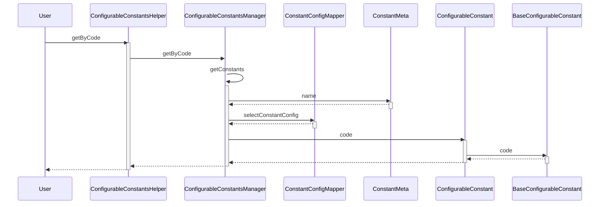

# constant-util

## 关于constant-util

constant-util可以让你将枚举定义在数据库中，实现动态的新增和修改枚举的值列表，而不用重新部署应用。


## 使用方式

- 使用注解声明一个动态枚举类
```java
@ConstantMeta(name="phone_type")
public class PhoneTypeEnum extends BaseConfigurableConstant {

    public PhoneTypeEnum(String code, Short value, String desc) {
        super(code, value, desc);
    }
}
```

- 在数据库中添加枚举值
```
insert into constant_config (constant_name, constant_code, constant_value, constant_desc, create_time, create_by, last_modify_time, last_modify_by)
values
('phone_type',  'IPHONE', 1, '苹果手机', now(), 'zhaomingyu', now(), 'zhaomingyu')
,('phone_type', 'XIAOMI', 2, '小米手机', now(), 'zhaomingyu', now(), 'zhaomingyu')
,('phone_type', 'HUAWEI', 3, '华为手机', now(), 'zhaomingyu', now(), 'zhaomingyu')
,('phone_type', 'VIVO',   4, 'VIVO手机', now(), 'zhaomingyu', now(), 'zhaomingyu');

```

- 在mybatis配置文件中增加动态枚举转换类（可选）

    如果数据表中有用枚举值作为字段，可以借助mybatis的typeHandler机制，使用ConfigurableConstantTypeHandler将字段值自动映射为枚举类
```xml
<?xml version="1.0" encoding="UTF-8" ?>
<!DOCTYPE configuration PUBLIC "-//mybatis.org//DTD Config 3.0//EN" "http://mybatis.org/dtd/mybatis-3-config.dtd">
<configuration>
    <typeHandlers>

        <typeHandler
                handler="com.myz.inf.constant.ConfigurableConstantTypeHandler"
                javaType="com.myz.inf.constant.demo.PhoneTypeEnum"/>
    </typeHandlers>

</configuration>

```

- 在代码中访问获取枚举
```java
PhoneTypeEnum iphone = ConfigurableConstantsHelper.getByCode(PhoneTypeEnum.class, "IPHONE");
```

## 实现原理

### 枚举获取调用时序图
